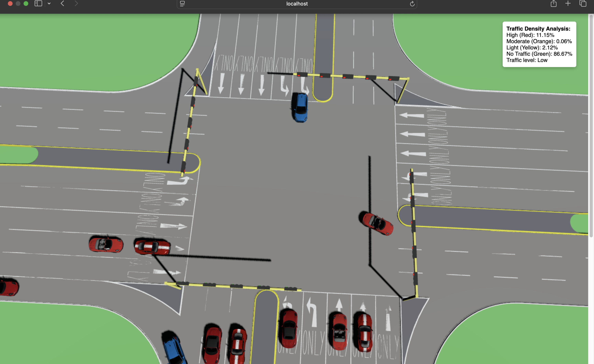
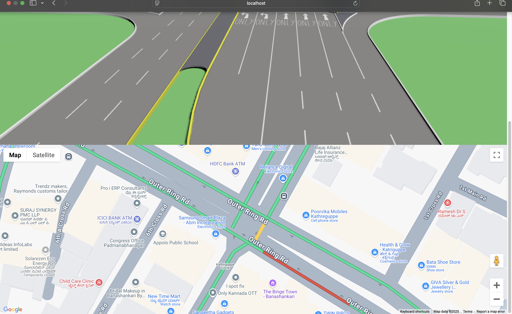
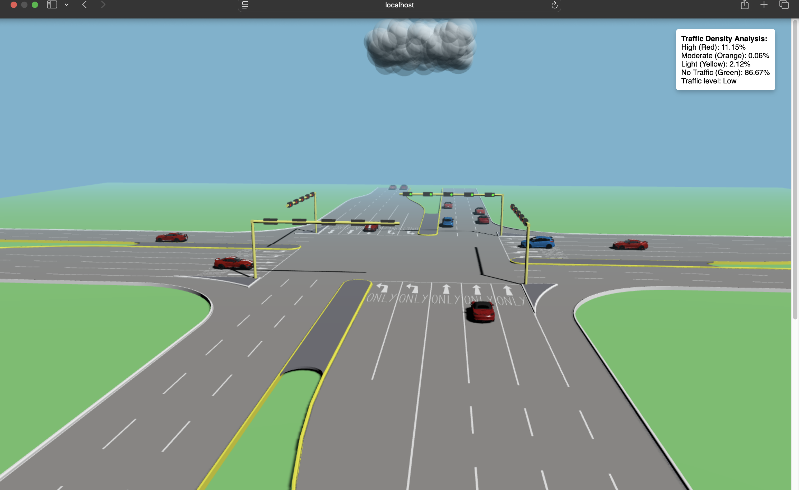

<h1 align="center">Walkthrough Snapshots for TrafficSync</h1>

This folder contains step-by-step snapshots illustrating the working of the TrafficSync project. Below is a brief walkthrough of each snapshot to guide you through the functionality of the project.

### 1. 4-Way Junction Simulation

This snapshot demonstrates the simulation of a 4-way traffic junction, highlighting the dynamic car loading based on traffic density.

### 2. Google Maps Real-Time Integration

This snapshot showcases the integration of real-time Google Maps data to calculate traffic density dynamically.

### 3. Traffic Density Analysis and Adaptive Rendering

Here, the project's adaptive rendering feature is shown, where traffic density is analyzed, and cars are added or removed dynamically to reduce congestion.

---

### Additional Details
- **Online Mode**: Simulates traffic density using real-time data. Visit the Vercel deployment link provided in the repository.
- **Offline Mode**: Loads a high-density traffic simulation by default for local testing.

For more details on setting up and running the project, refer to the main repository documentation. 
